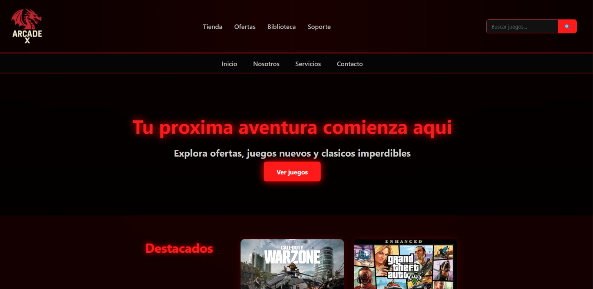
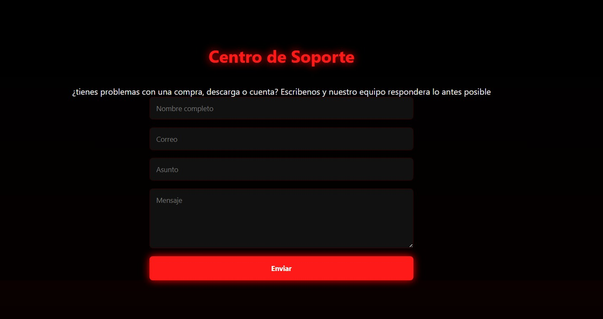
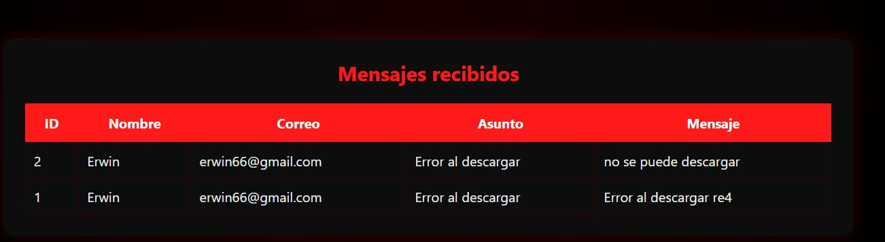
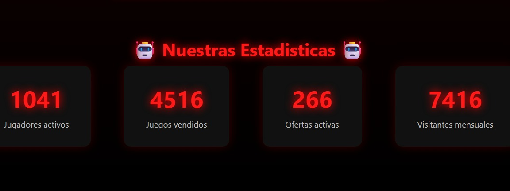

**🎮 Arcade X Store**

Arcade X Store es una página web temática gamer desarrollada como proyecto académico, ampliada con funcionalidades reales de backend usando Flask y base de datos SQLite.
El proyecto incluye diseño frontend, almacenamiento de mensajes de soporte y panel de visualización de datos.

**🚀 Tecnologías utilizadas: Se implementaron las siguientes tecnologias**

- HTML5
- CSS3
- JavaScript
- Python
- Flask
- SQLite3
- Git & GitHub

**🧩 Funcionalidades**

✅ Diseño web estilo tienda gamer
✅ Sección de soporte con formulario funcional
✅ Guardado de mensajes en base de datos
✅ Panel para visualizar mensajes enviados
✅ Organización por carpetas (templates, static, database)

📂 **Estructura del proyecto**
- "app.py" → servidor Flask
- "templates/" → archivos HTML
- "static/" → CSS e imágenes
- "database/juegos.db" → base de datos SQLite

**▶ Cómo ejecutar el proyecto**

1. Clonar repositorio
2. Instalar dependencias

pip install flask

3. Ejecutar aplicación

python app.py

4. Abrir en navegador:

http://127.0.0.1:5000/

**📸 Capturas del proyecto**

**pagina principal**

**Formulario de soporte**

**panel de mensajea**

**banner juegos**

**Cifras ascendientes**

**👨‍💻 Autor**

Desarrollado por Erwin Arley Delgado
Proyecto académico ampliado con funcionalidades propias para aprendizaje backend.

**📌 Estado del proyecto**

Proyecto funcional en versión inicial.
Planeadas mejoras futuras: validaciones, panel admin, autenticación y despliegue online.
